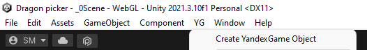
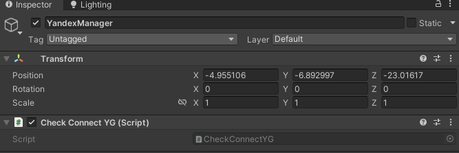
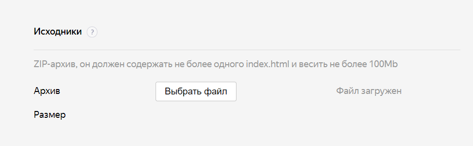
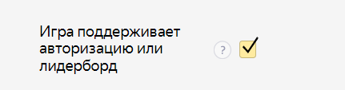
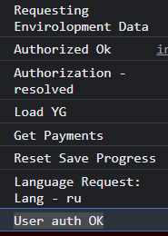
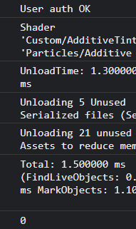
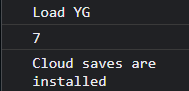
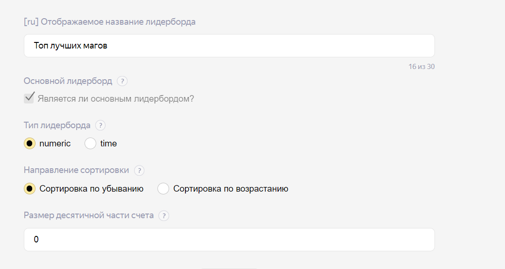
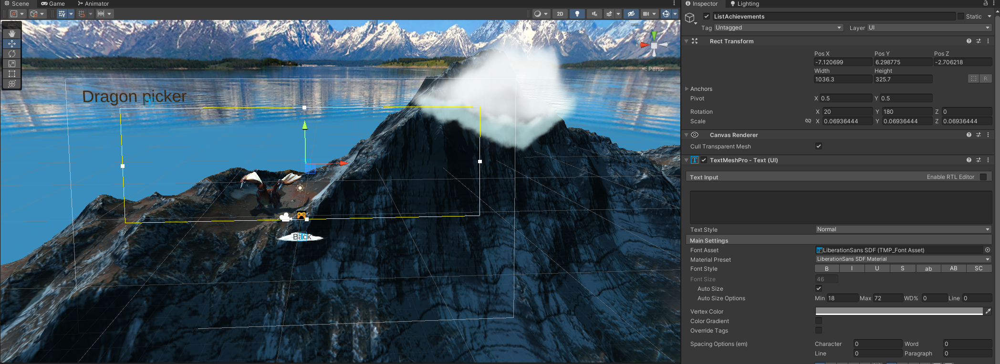

# Лабораторная работа № 5. Создание индивидуальной системы достижения пользователя и ее интеграция в пользовательский интерфейс
Отчет по лабораторной работе №5 выполнил:
- Строшков Артем Валерьевич
- РИ-300004

Отметка о выполнении заданий (заполняется студентом):

| Задание | Выполнение | Баллы |
| ------ | ------ | ------ |
| Задание 1 | * |  |
| Задание 2 | # |  |
| Задание 3 | # |  |

знак "*" - задание выполнено; знак "#" - задание не выполнено;

Работу проверили:
- к.т.н., доцент Денисов Д.В.
- к.э.н., доцент Панов М.А.
- ст. преп., Фадеев В.О.

[](https://nodesource.com/products/nsolid)

[](https://travis-ci.org/joemccann/dillinger)

Структура отчета

- Данные о работе: название работы, фио, группа, выполненные задания.
- Цель работы.
- Задание 1.
- Код реализации выполнения задания. Визуализация результатов выполнения (если применимо).
- Задание 2.
- Код реализации выполнения задания. Визуализация результатов выполнения (если применимо).
- Задание 3.
- Код реализации выполнения задания. Визуализация результатов выполнения (если применимо).
- Выводы.
- ✨Magic ✨

## Цель работы
Cоздание интерактивного приложения с рейтинговой системой пользователя и интеграция игровых сервисов в готовое приложение.
## Задание 1
### Используя видео-материалы практических работ 1-5 повторить реализацию приведенного ниже функционала:
### – 1 Практическая работа «Интеграции авторизации с помощью Яндекс SDK»
### – 2 Практическая работа «Сохранение данных пользователя на платформе Яндекс Игры»
### – 3 Практическая работа «Сбор данных об игроке и вывод их в интерфейсе»
### – 4 Практическая работа «Интеграция таблицы лидеров»
### – 5 Практическая работа «Интеграция системы достижений в проект»

#### Ход работы (задание 1).
1) Создать объект YandexGame



2) Написать скрипт проверки авторизации пользователя

```cs

using UnityEngine;
using YG;

public class CheckConnectYG : MonoBehaviour
{
    private void OnEnable() {
        YandexGame.GetDataEvent += CheckSDK;
    }
    private void OnDisable() {
        YandexGame.GetDataEvent -= CheckSDK;
    }
    // Start is called before the first frame update
    void Start()
    {
        if(YandexGame.SDKEnabled == true){
            CheckSDK();
        }
    }

    // Update is called once per frame
    void Update()
    {
        
    }

    public void CheckSDK()
    {
        if(YandexGame.auth == true){
                Debug.Log("User auth OK");
            }
            else{
                Debug.Log("User not auth");
                YandexGame.AuthDialog();
            }
    }
}

```

3) Добавить объект YandexManager, прикрепить к нему скрипт




4) Собрать билд под WebGL
5) Загрузить zip архив(сжатый билд игры) через консоль разработчика яндекс игр



6) Пройти проверку фалов исходника, включить авторизацию



7) Протестировать игру через черновик после проверки



8) Изменить скрипт из плагина

```cs

    public class SavesYG
    {
        public bool isFirstSession = true;
        public string language = "ru";
        public bool feedbackDone;
        public bool promptDone;

        // Ваши сохранения
        public int score;
    }

```

9) Удалить скрипт SaveTest из папки ExampleScripts плагина
10) Изменить скрипт DragonPicker, добавив сохранение очков

```cs

using System.Collections.Generic;
using UnityEngine;
using UnityEngine.SceneManagement;
using YG;
using TMPro;


public class DragonPicker : MonoBehaviour
{
    private void OnEnable() {
        YandexGame.GetDataEvent += GetLoadSave;
    }
    private void OnDisable() {
        YandexGame.GetDataEvent -= GetLoadSave;
    }
    public GameObject energyShieldPrefab;
    public int numEnergyShield = 3;
    public float energyShieldBottomY = -6f;
    public float energyShieldRadius = 1.5f;
    public List<GameObject> shieldList;
    public TextMeshProUGUI scoreGT;


    // Start is called before the first frame update
    void Start()
    {
        if(YandexGame.SDKEnabled == true){
            GetLoadSave();
        }
        
        shieldList = new List<GameObject>();
        for (int i = 1; i <= numEnergyShield; i++){
            GameObject tShieldGo = Instantiate<GameObject>(energyShieldPrefab);
            tShieldGo.transform.position = new Vector3(0, energyShieldBottomY, 0);
            tShieldGo.transform.localScale = new Vector3(1*i, 1*i, 1*i);
            shieldList.Add(tShieldGo);
        }
        
    }

    // Update is called once per frame
    void Update()
    {
        
    }

    public void DragonEggDestroyed(){
        // GameObject[] tDragonEggArray = GameObject.FindGameObjectsWithTag("Dragon Egg");
        // foreach (GameObject tGI in tDragonEggArray){
        //     Destroy(tGI);
        // }
        int shieldIndex = shieldList.Count - 1;
        GameObject tShieldGo = shieldList[shieldIndex];
        shieldList.RemoveAt(shieldIndex);
        Destroy(tShieldGo);

        if (shieldList.Count == 0) {
            GameObject scoreGO = GameObject.Find("Score");
            scoreGT = scoreGO.GetComponent<TextMeshProUGUI>();
            UserSave(int.Parse(scoreGT.text));
            SceneManager.LoadScene("_0Scene");
            GetLoadSave();
        }
    }

    public void GetLoadSave(){
        Debug.Log(YandexGame.savesData.score);
    }

    public void UserSave(int currentScore){
        YandexGame.savesData.score = currentScore;
        YandexGame.SaveProgress();
    }
}

```

11) Собрать новый билд
12) Загрузить новую версию в раздел исходников яндекс игр(вклучить поддержку облачных сохранений)
13) Проверить работу сохранений





14) Добавить переменную в SavesYG

```cs

    public int bestScore = 0;

```

15) Добавить лучший счет в DragonPicker.cs

```cs
...
    public void DragonEggDestroyed(){
        // GameObject[] tDragonEggArray = GameObject.FindGameObjectsWithTag("Dragon Egg");
        // foreach (GameObject tGI in tDragonEggArray){
        //     Destroy(tGI);
        // }
        int shieldIndex = shieldList.Count - 1;
        GameObject tShieldGo = shieldList[shieldIndex];
        shieldList.RemoveAt(shieldIndex);
        Destroy(tShieldGo);

        if (shieldList.Count == 0) {
            GameObject scoreGO = GameObject.Find("Score");
            scoreGT = scoreGO.GetComponent<TextMeshProUGUI>();
            UserSave(int.Parse(scoreGT.text), YandexGame.savesData.bestScore);
            SceneManager.LoadScene("_0Scene");
            GetLoadSave();
        }
    }

    public void GetLoadSave(){
        Debug.Log(YandexGame.savesData.score);
    }

    public void UserSave(int currentScore, int currentBestScore){
        YandexGame.savesData.score = currentScore;
        if(currentScore > currentBestScore)
        {
            YandexGame.savesData.bestScore = currentBestScore;
        }
        YandexGame.SaveProgress();
    }
...
```

16) Добавить отображение лучшего счета

```cs

using UnityEngine;
using YG;
using TMPro;

public class CheckConnectYG : MonoBehaviour
{
    private void OnEnable()
    {
        YandexGame.GetDataEvent += CheckSDK;
    }
    private void OnDisable()
    {
        YandexGame.GetDataEvent -= CheckSDK;
    }

    public TextMeshProUGUI scoreBest;
    // Start is called before the first frame update
    void Start()
    {
        if (YandexGame.SDKEnabled == true)
        {
            CheckSDK();
        }
    }

    // Update is called once per frame
    void Update()
    {

    }

    public void CheckSDK()
    {
        if (YandexGame.auth == true)
        {
            Debug.Log("User auth OK");
        }
        else
        {
            Debug.Log("User not auth");
            YandexGame.AuthDialog();
        }
        GameObject scoreGO = GameObject.Find("BestScore");
        scoreBest = scoreGO.GetComponent<TextMeshProUGUI>();
        scoreBest.text = "Best Score: " + YandexGame.savesData.bestScore.ToString();
    }
}

```


17) Собрать билд
18) Проверить через черновки из консоли разработчика
19) Добавить на сцену _1Scene tmp text "PlayerName"
20) Добавить вывод имени пользователя в скрипт DragonPicker

```cs
...
public TextMeshProUGUI playerName;
...
void Start()
    {
        if(YandexGame.SDKEnabled == true){
            GetLoadSave();
        }
        
        shieldList = new List<GameObject>();
        for (int i = 1; i <= numEnergyShield; i++){
            GameObject tShieldGo = Instantiate<GameObject>(energyShieldPrefab);
            tShieldGo.transform.position = new Vector3(0, energyShieldBottomY, 0);
            tShieldGo.transform.localScale = new Vector3(1*i, 1*i, 1*i);
            shieldList.Add(tShieldGo);
        }
        GameObject playerNamePrefabGUI = GameObject.Find("PlayerName");
        playerName = playerNamePrefabGUI.GetComponent<TextMeshProUGUI>();
        playerName.text = YandexGame.playerName;
    }

```

21) Организовать добавление информации в лидерборд

```cs
public void DragonEggDestroyed(){
        // GameObject[] tDragonEggArray = GameObject.FindGameObjectsWithTag("Dragon Egg");
        // foreach (GameObject tGI in tDragonEggArray){
        //     Destroy(tGI);
        // }
        int shieldIndex = shieldList.Count - 1;
        GameObject tShieldGo = shieldList[shieldIndex];
        shieldList.RemoveAt(shieldIndex);
        Destroy(tShieldGo);

        if (shieldList.Count == 0) {
            GameObject scoreGO = GameObject.Find("Score");
            scoreGT = scoreGO.GetComponent<TextMeshProUGUI>();
            UserSave(int.Parse(scoreGT.text), YandexGame.savesData.bestScore);
            YandexGame.NewLeaderboardScores("TopPlayerScore", int.Parse(scoreGT.text));
            SceneManager.LoadScene("_0Scene");
            GetLoadSave();
        }
    }

```

22) Создать лидерборд в консоли разработчика яндекс игр



23) Создать новый раздел канваса с достижениями
24) Создать лист достижений



25) Добавить достижения в скрипт CheckConnectYG

```cs
...
public TextMeshProUGUI achievements;
...
public void CheckSDK()
    {
        if (YandexGame.auth == true)
        {
            Debug.Log("User auth OK");
        }
        else
        {
            Debug.Log("User not auth");
            YandexGame.AuthDialog();
        }

        GameObject scoreGO = GameObject.Find("BestScore");
        scoreBest = scoreGO.GetComponent<TextMeshProUGUI>();
        scoreBest.text = "Best Score: " + YandexGame.savesData.bestScore.ToString();

        if(YandexGame.savesData.achivments == null && GameObject.Find("ListAchievements") == null){

        }
        else{
            foreach(string value in YandexGame.savesData.achivments){
                achievements.text = achievements.text + value + Environment.NewLine;
            }
        }
    }
```

26) Добавить перменную в SavesYG

```cs
public string[] achivments;
```

27) Добавить обработчик достижений в DragonPicker.cs

```cs
public void DragonEggDestroyed(){
        // GameObject[] tDragonEggArray = GameObject.FindGameObjectsWithTag("Dragon Egg");
        // foreach (GameObject tGI in tDragonEggArray){
        //     Destroy(tGI);
        // }
        int shieldIndex = shieldList.Count - 1;
        GameObject tShieldGo = shieldList[shieldIndex];
        shieldList.RemoveAt(shieldIndex);
        Destroy(tShieldGo);

        if (shieldList.Count == 0) {
            GameObject scoreGO = GameObject.Find("Score");
            scoreGT = scoreGO.GetComponent<TextMeshProUGUI>();
            var achs = YandexGame.savesData.achivments;
            achs[0] = "Берги щиты!";
            UserSave(int.Parse(scoreGT.text), YandexGame.savesData.bestScore, achs);
            YandexGame.NewLeaderboardScores("TopPlayerScore", int.Parse(scoreGT.text));
            SceneManager.LoadScene("_0Scene");
            GetLoadSave();
        }
    }

    public void GetLoadSave(){ 
        
    }

    public void UserSave(int currentScore, int currentBestScore, string[] currAchiv){
        YandexGame.savesData.score = currentScore;
        if(currentScore > currentBestScore)
        {
            YandexGame.savesData.bestScore = currentBestScore;
        }
        YandexGame.savesData.achivments = currAchiv;
        YandexGame.SaveProgress();
    }
```

## Задание 2
### Описать не менее трех дополнительных функций Яндекс SDK, которые могут быть интегрированы в игру.

#### Ход работы (задание 2).


## Задание 3
### Доработать стилистическое оформление списка лидеров и системы достижений, реализованных в задании 1

#### Ход работы (задание 3).


## Выводы
- Реализованы следющие элементы игры: авторизация, сохранение данных пользователя, таблица лидеров, сисетма достижений

